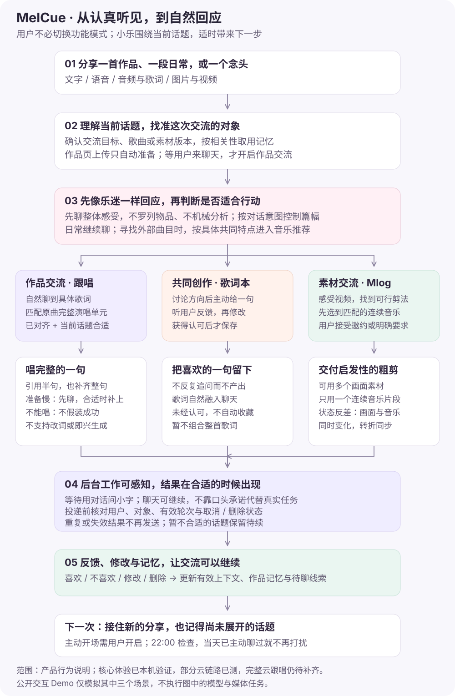
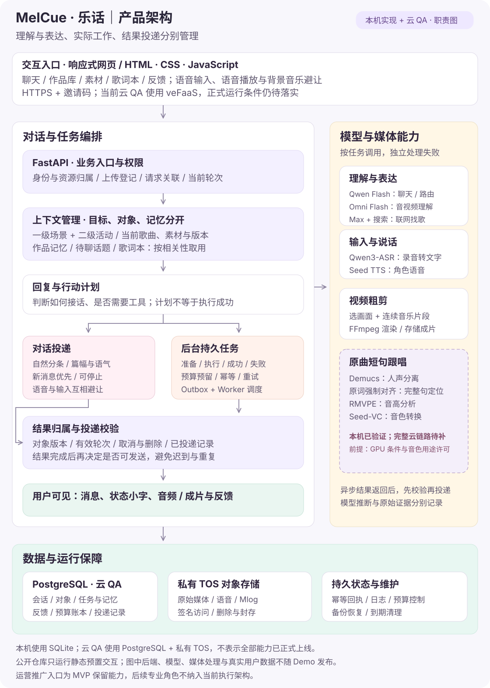

<a href="https://dehydration630.github.io/melcue-demo/"></a>

# MelCue / 乐话 · 音乐人的 AI 乐迷与陪伴助手

从“听听我新写的歌”，到一句自然的跟唱、一条被记下的歌词，以及一段日常素材带来的创作灵感。

**[体验交互 Demo ↗](https://dehydration630.github.io/melcue-demo/)** · [一页产品案例](docs/CASE_STUDY.md) · [PRD](docs/PRD.md) · [设计决策](docs/DECISIONS.md) · [架构与测试](docs/ARCHITECTURE.md)

> 本仓库是公开作品集与独立演示代码，不是生产服务源码。交互 Demo 使用虚构作品和预置内容，无需登录、不调用模型、不上传文件，也不生成或播放歌声。真实产品已完成多场景本机验证与部分云端集成测试；尚未开展外部音乐人试用，完整云端跟唱和正式开放条件仍待补齐。状态截至 2026-10-09。

## 30 秒了解项目

| 项目 | 内容 |
|---|---|
| 目标用户 | 独立音乐人、乐队成员与 AI 音乐创作者 |
| 用户问题 | 完成作品后缺少愿意认真听、持续交流的人；素材和灵感难以自然转化为下一步行动 |
| 产品定位 | 一位记得你的作品、能主动延续话题的 AI 乐迷“小乐” |
| 核心体验 | 音频理解与作品交流、自然短句跟唱、单句共创与歌词本、素材交流与 Mlog 粗剪、音乐推荐 |
| 产品取舍 | 不做复杂剪辑软件，不承诺走红；运营推广能力暂不深化 |
| 我的角色 | 需求与定位、对话及交互设计、模型对比、真实听感验收、成本与上线边界决策 |
| AI 协作 | 使用 AI 编程工具协助实现、测试、排障与文档；由项目负责人制定标准并反复体验验收 |
| 已知限制 | 创始人自测有偏差，尚无外部留存或商业化数据；音色用途许可与云 GPU 条件仍待确认 |

## 怎么看这个作品

- **3 分钟**：交互 Demo → [产品案例](docs/CASE_STUDY.md)。体验三个关键时刻：听完歌自然唱一句、认可后保存歌词、接受邀请后才做 Mlog。
- **15 分钟**：[研究与假设](docs/RESEARCH.md) → [PRD](docs/PRD.md) → [决策与反例](docs/DECISIONS.md)。看需求如何从宣发工具转向“作品被认真在意”。
- **20 分钟**：[系统架构](docs/ARCHITECTURE.md) → [评测方法](docs/EVALUATION.md) → [测试说明](docs/TESTING.md)。看聊天、任务、上下文和结果投递如何分工。

## 三个值得讨论的设计

### 1. 跟唱是关系里的一个时刻

先聊整首歌带来的感受，再自然谈到具体歌词。条件满足时唱出完整的一句；后台准备以对话间小字呈现，不让角色反复“接任务”。定位不可靠时不假装能唱，听音先完成则先聊，跟唱准备好后再自然接续。

### 2. 能聊，不等于已经执行

曾出现答应制作却没有任务、旧结果迟到、用户换话题后重复投递等问题。因此把交流目标、作品对象、任务状态、消息投递分开管理。演示中可在跟唱准备时切换场景，观察旧结果被取消投递。

### 3. 用户的反例，比“功能做出来了”更重要

抽象歌曲配具象 AI 视频未被采用；真实排练素材粗剪却带来了启发。由此收窄 Mlog 定位，并要求“状态反差”同时满足画面反差和同一连续音乐片段中的反差，转折同步。

## 产品流程

先接住作品与日常，再根据交流意图自然触发工具；跟唱、共创与 Mlog 各自遵守不同的完成条件。



## 产品架构

把对话、对象上下文、后台任务与结果投递分开管理。图中区分当前本机与云 QA 能力，虚线标出尚待完成的完整云跟唱链路。



更多说明见 [架构文档](docs/ARCHITECTURE.md)。公开静态 Demo 不运行图中的后端服务。

## 本地运行与测试

静态 Demo 没有构建依赖：

```sh
python3 -m http.server 8080 --bind 127.0.0.1
# 打开 http://127.0.0.1:8080
```

Node.js 18+ 运行独立规则测试：

```sh
node --test tests/*.test.mjs
python3 scripts/check_publication.py
```

`demo-core.mjs` 是为讲解重新编写的规则示例，不代表生产模型、歌词定位算法或完整任务调度器。它不包含真实素材、生产配置和用户记录。

## 更多资料与交流

[评测](docs/EVALUATION.md) · [指标设计](docs/METRICS.md) · [路线图](docs/ROADMAP.md) · [公开范围](docs/PUBLICATION.md) · [许可](NOTICE.md)

欢迎在 [Issues](https://github.com/Dehydration630/melcue-demo/issues) 讨论：完整歌词单元定位、异步对话体验、音色授权边界与小规模上线架构。请使用虚构的最小复现，不提交歌曲、密钥或私人聊天记录。欢迎交流 AI 产品经理相关机会。
