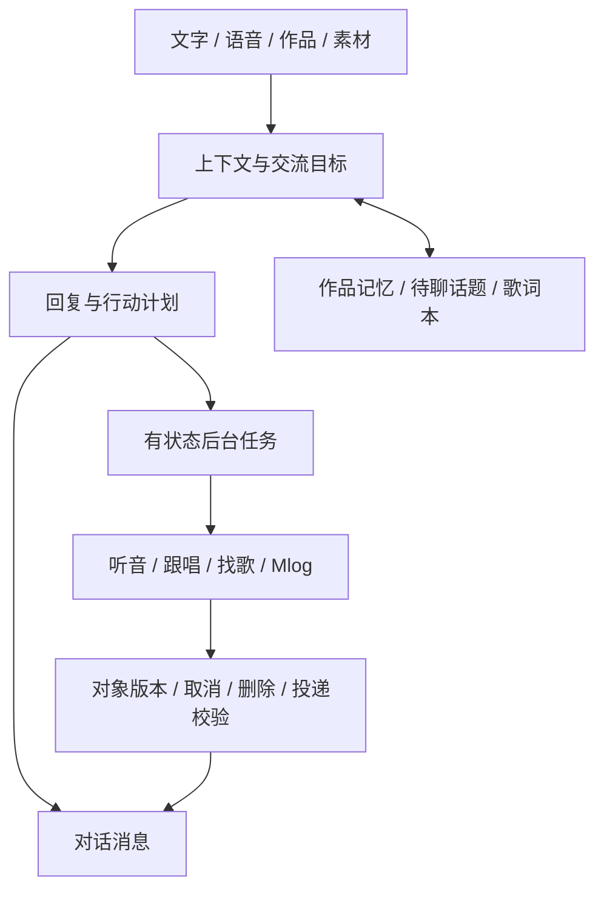

# 架构：聊天与后台工作怎样协作

## 真实产品的概念结构



场景回答“现在在聊什么”，对象回答“是哪首歌/哪段素材”，任务回答“实际工作进展如何”，投递回答“此时能否把结果交给这个用户”。这些维度不能由一个场景标签替代。

真实工程使用 Python 服务与网页前端；本机存储与云端 PostgreSQL、私有对象存储及函数任务链路按环境适配。聊天、听音、语音识别、语音合成分别选型；音频处理涉及人声分离、音高分析和音色转换，剪辑使用 FFmpeg。部分云链路已验证，完整云跟唱仍有运行资格和许可前提。

## 本仓库实际运行的内容

```
index.html + style.css
        ↓
app.mjs：预置场景、消息节奏、用户选择
        ↓
demo-core.mjs：完整句匹配、版本检查、示意反差判定
```

这些文件是独立重写的教学演示，不是生产工程摘录。没有模型请求、上传、账号、数据库、音视频渲染或商业 SDK。歌词本只保存在当前页面内存，刷新或重置后丢失。

## 可复用的思路与局限

- `completeUnit` 展示“短引用映射到完整句”，仅做字符包含匹配，不具备 ASR/强制对齐或真实路由能力。
- `canDeliver` 检查演示会话版本、作品对象和已交付键；生产系统还需要事务、身份隔离、持久化与重试治理。
- `contrastEligible` 的 100ms 容差仅为示例参数，不是声称已验证的生产阈值，也不会分析音视频。
- 页面按钮与虚构数据用于说明交互取舍，不评估真实模型输出。
